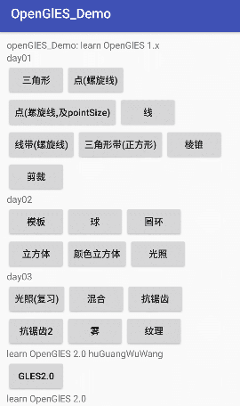
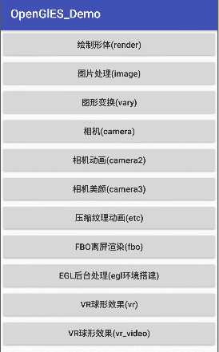
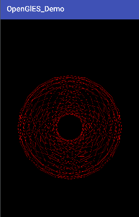
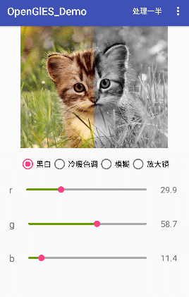
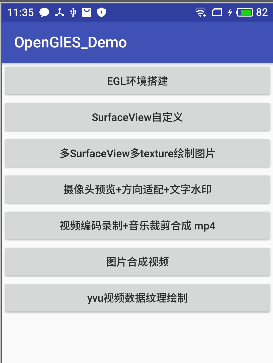

# OpenGlES_Demo
OpenGlES for learn 

  OpenGlES 1.0: 
  
      01.基础三角形绘制
      02.基础
      03.点
      04.线模式三角形
      05.深度测试表面剔除裁剪
      06.模板缓冲区
      07.球体
      08.圆环1
      09.圆环2
      10.颜色立方体正交投影
      11.光照
      12.光照2
      13.颜色和材料
      14.材料和光照
      15.光照，混合，抗锯齿
      16.雾
      17.纹理贴图
      
  OpenGlES 2.0:（come from ww） 
  
          绘制形体(render)
          图片处理(image)
          图片美颜(beautiful)
          图形变换(vary)
          相机(camera)
          相机动画(camera2)
          相机美颜(camera3)
          相机水印(camera4)
          压缩纹理动画(etc)
          FBO离屏渲染(fbo)
          EGL后台处理(egl环境搭建)
          VR球形效果(vr)
          VR球形效果(vr_video)
          颜色混合(blend)
          3D obj模型(obj)
          obj+mtl模型(obj_mtl)
          光照(light)
  OpenGlES 2.0 test: 
  
  主要是针对上面GLES2.0的一次简单复习的代码 
  基本形状的绘制： 
      
           三角形、正方形、在相机视角下的三角形、彩色三角形
           正方体、圆柱体、圆锥体、球体
           手绘点、旋转三角形（平移、旋转、缩放） 
      纹理绘制
           绘制图片，黑白效果、冷色调效果、暖色调效果、模糊效果、放大镜效果
      相机处理
           利用OpenGLES完成Camera基本预览效果
           基于预览完成拍照，并增加水印功能
   OpenGlES 2.0 test2 : 
   
          EGL环境搭建
          SurfaceView自定义
          多SurfaceView多texture绘制图片
          摄像头预览+方向适配+文字水印
          视频编码录制+音乐裁剪合成 mp4
          图片合成视频
          yvu视频数据纹理绘制

   
   
   
   
   
